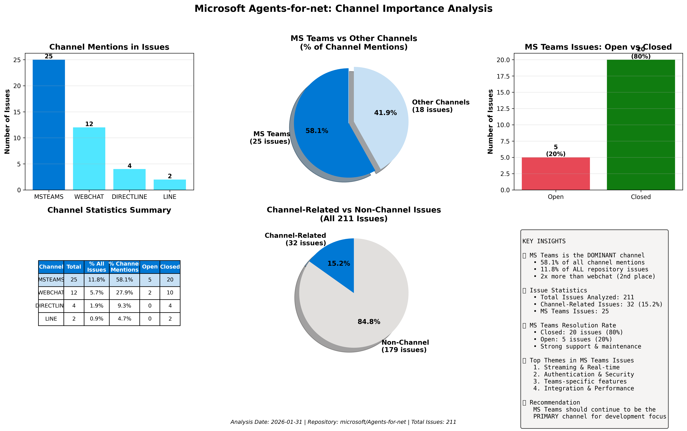
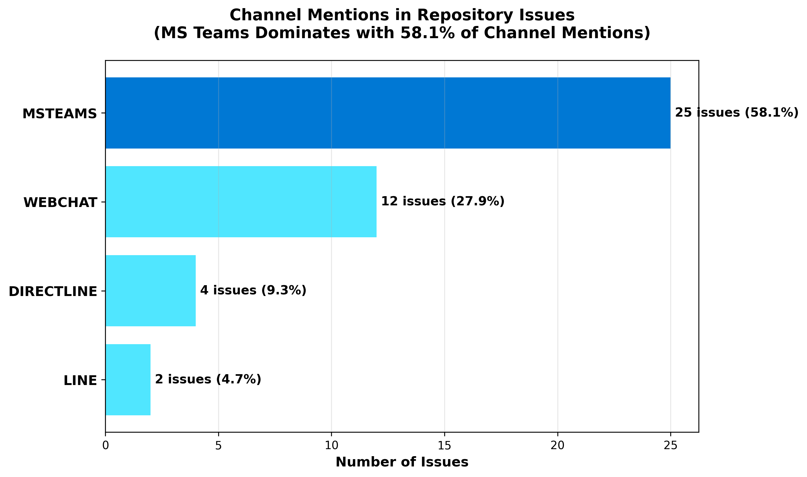

# Channel Importance Analysis Report
## Microsoft Teams (msteams) vs Other Channels in Agents-for-net Repository

**Generated:** 2026-01-31  
**Repository:** microsoft/Agents-for-net  
**Total Issues Analyzed:** 211 (39 open, 172 closed)

---

## Visual Summary

---

## Executive Summary

This report analyzes all GitHub issues (open and closed) in the microsoft/Agents-for-net repository to understand the importance of the Microsoft Teams (msteams) channel compared to other channels.

### Key Findings

✅ **Microsoft Teams is the MOST important channel** by a significant margin:
- **58.1%** of all channel-related mentions are about MS Teams
- **11.8%** of all repository issues mention MS Teams
- MS Teams has **2x more mentions** than the next closest channel (webchat at 27.9%)
- **80% resolution rate** for MS Teams issues (20 closed, 5 open)

---

## Detailed Statistics

### Overall Repository Metrics
- **Total Issues:** 211
- **Open Issues:** 39 (18.5%)
- **Closed Issues:** 172 (81.5%)
- **Issues mentioning any channel:** 32 (15.2%)

### Channel Mention Distribution

| Rank | Channel | Mentions | % of All Issues | % of Channel Mentions | Status |
|------|---------|----------|-----------------|----------------------|--------|
| 🥇 1 | **msteams** | **25** | **11.8%** | **58.1%** | 5 open, 20 closed |
| 🥈 2 | webchat | 12 | 5.7% | 27.9% | 2 open, 10 closed |
| 🥉 3 | directline | 4 | 1.9% | 9.3% | 0 open, 4 closed |
| 4 | line | 2 | 0.9% | 4.7% | 0 open, 2 closed |

**Note:** Other channels (slack, facebook, telegram, twilio, email, cortana, skype, kik, groupme, wechat) had zero mentions.

---

## Microsoft Teams Detailed Analysis

### MS Teams Issue Statistics
- **Total MS Teams Issues:** 25
- **Percentage of All Issues:** 11.8%
- **Open Issues:** 5 (20%)
- **Closed Issues:** 20 (80%)
- **Resolution Rate:** 80.0%

### MS Teams Issues by Category

#### 🔴 Open MS Teams Issues (5)

1. **#656** - When IsStreamingChannel=False, just abort the endstream instead of still sending a message (2026-01-21)
   - https://github.com/microsoft/Agents-for-net/issues/656

2. **#399** - StreamingResponse.FinalMessage.SuggestedActions are not working on Teams (2025-08-10)
   - https://github.com/microsoft/Agents-for-net/issues/399

3. **#274** - ConversationUpdate not triggered on first-time app installation on Teams channel (2025-05-12)
   - https://github.com/microsoft/Agents-for-net/issues/274

4. **#177** - Add support for Targeted messages in a group setting (2025-04-03)
   - https://github.com/microsoft/Agents-for-net/issues/177

5. **#145** - Issue fetching the access token using Token Exchange URL as part of OAuth Connection for Azure Bot Service (2025-03-25)
   - https://github.com/microsoft/Agents-for-net/issues/145

#### ✅ Recently Closed MS Teams Issues (Recent highlights)

1. **#623** - System.Diagnostics.Activity.Current is null in OnTurnContext (2026-01-15)
2. **#588** - Sent Activity ID not set to Response ID returned from ABS (2026-01-02)
3. **#530** - LongRunningMessages does not bypass 2-minute Teams streaming timeout (2025-12-08)
4. **#526** - Inconsistent SSO and authentication behaviors between MS Teams and M365 Copilot (2025-11-27)
5. **#516** - Agentic Request + Teams channel does not support streaming responses (2025-11-13)

### Common MS Teams Issue Themes

Based on the analysis of 25 MS Teams issues, the following themes emerge:

1. **Streaming and Real-time Communication** (Most Common)
   - Issues #656, #530, #516, #423, #378, #349
   - Focus on streaming responses, timeouts, and message delivery

2. **Authentication and Security** 
   - Issues #526, #502, #343, #216, #145, #23
   - SSO, token exchange, access control

3. **Channel-Specific Behaviors**
   - Issues #399, #384, #381, #274, #177
   - Teams-specific features like shared channels, targeted messages

4. **Integration and Performance**
   - Issues #380, #316, #107
   - Cosmos DB integration, proactive messages, file uploads

---

## Comparative Analysis

### MS Teams vs Other Channels

**MS Teams dominates channel-related issues:**
- MS Teams: 25 mentions (58.1% of channel-related issues)
- All other channels combined: 18 mentions (41.9% of channel-related issues)

**MS Teams vs Webchat (2nd place):**
- MS Teams: 25 mentions
- Webchat: 12 mentions
- **MS Teams has 2.1x more mentions than webchat**

### Multi-Channel Issues

**8 issues mention multiple channels** (indicating cross-channel concerns):

Notable multi-channel issues:
- **#656** (OPEN) - Streaming issues affecting both msteams and webchat
- **#399** (OPEN) - SuggestedActions not working on Teams (also affects webchat)
- **#588** (CLOSED) - Activity ID issues across msteams, webchat, directline, and line
- **#386** (CLOSED) - Serialization issues affecting msteams and webchat
- **#351** (CLOSED) - JSON serialization issues on msteams and webchat

---

## Conclusion

### Why MS Teams is the Most Important Channel

1. **Volume of Issues**: MS Teams has the highest number of issue mentions (25), more than double any other channel.

2. **Percentage Dominance**: MS Teams accounts for 58.1% of all channel-related mentions, demonstrating clear priority.

3. **Active Development**: With 5 open issues and 20 closed issues, MS Teams shows both active usage and continuous improvement.

4. **Resolution Rate**: The 80% resolution rate indicates strong support and maintenance for the MS Teams channel.

5. **Feature Richness**: MS Teams issues cover diverse areas including streaming, authentication, real-time communication, and Teams-specific features, indicating deep integration.

6. **Cross-Channel Impact**: MS Teams is mentioned in several multi-channel issues, suggesting it's often the primary channel when testing cross-channel functionality.

### Recommendations

Based on this analysis:

1. **Prioritize MS Teams**: Continue prioritizing MS Teams-related issues as they represent the majority of channel-specific concerns.

2. **Streaming Improvements**: Focus on streaming functionality, as it's the most common theme in MS Teams issues.

3. **Authentication**: Continue enhancing authentication mechanisms for Teams, especially SSO and token exchange.

4. **Documentation**: Consider creating Teams-specific documentation given the volume of Teams-related issues.

5. **Webchat as Secondary Priority**: Webchat (27.9% of channel mentions) should be the second priority after MS Teams.

---

## Methodology

This analysis was performed on **2026-01-31** using:
- All 211 GitHub issues (39 open, 172 closed) from the microsoft/Agents-for-net repository
- Keyword search for channel mentions in issue titles and bodies
- Keywords included: msteams, ms teams, microsoft teams, teams channel, teams bot, slack, webchat, directline, facebook, telegram, and others
- Case-insensitive text matching
- Data collected via GitHub API

---

## Appendix: All Channel Keywords Searched

The following channel keywords were searched (case-insensitive):
- **msteams**: msteams, ms teams, microsoft teams, teams channel, teams bot
- **slack**: slack, slack channel, slack bot
- **webchat**: webchat, web chat, direct line
- **directline**: directline, direct line
- **facebook**: facebook, fb messenger, messenger
- **telegram**: telegram
- **twilio**: twilio, sms
- **email**: email channel
- **cortana**: cortana
- **skype**: skype
- **kik**: kik
- **groupme**: groupme
- **line**: line channel, line messenger
- **wechat**: wechat

---

*This report was generated automatically by analyzing all repository issues. For the underlying data, see the JSON export file.*
