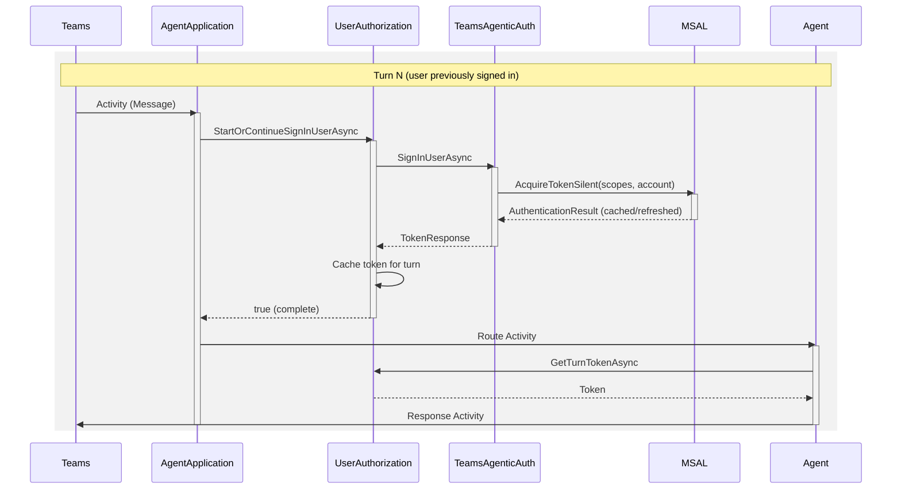
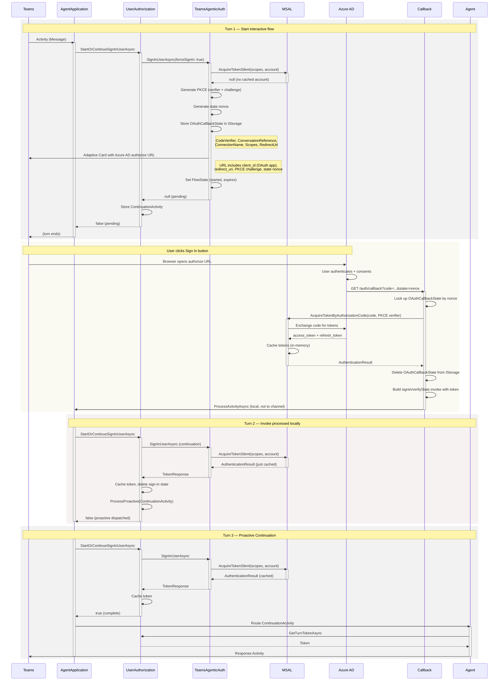
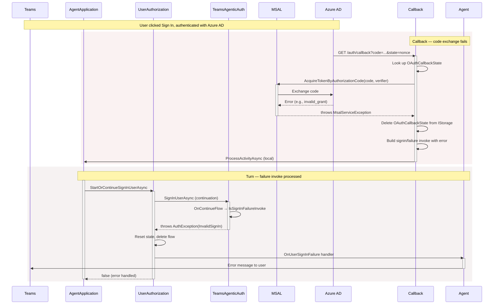
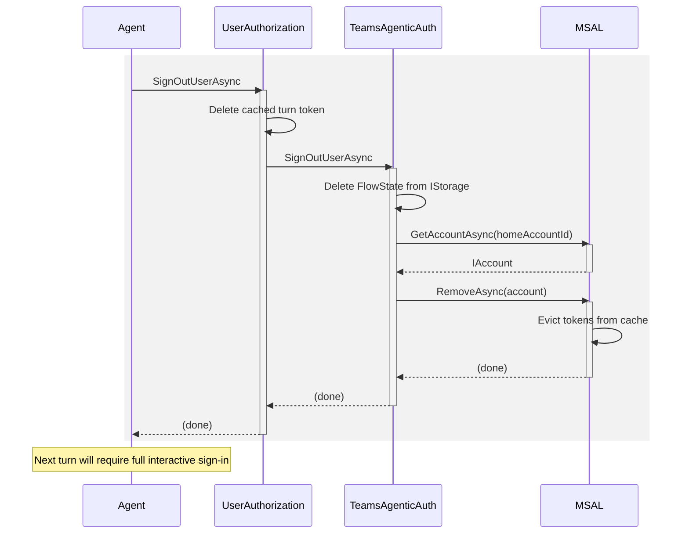

# TeamsAgenticAuthorization — Sequence Diagrams

- **Teams** is the Teams backend (SMBA).
- **Agent** is the customer's agent business logic.
- **AgentApplication** is the SDK-provided application framework.
- **UserAuthorization** is the SDK-provided OAuth orchestration layer.
- **TeamsAgenticAuth** is `TeamsAgenticAuthorization`, the `IUserAuthorization` implementation for agentic mode.
- **MSAL** is the Microsoft Authentication Library (in-process, with token cache).
- **Azure AD** is the Microsoft Entra ID authorization endpoint.
- **Callback** is the bot-hosted `/auth/callback` HTTP endpoint (`TeamsAgenticOAuthCallbackEndpoint`).

## Why This Exists

In Teams **agentic mode**, the standard OAuthCard is not accepted by Teams. Agent blueprint app registrations cannot perform interactive OAuth (`response_type=code` returns AADSTS82018). This flow uses a separate regular app registration for interactive OAuth, with the bot hosting its own callback endpoint for the authorization code exchange.

## Already Signed In (MSAL cache hit)

After a successful interactive flow, MSAL caches the access and refresh tokens. Subsequent turns use `AcquireTokenSilent` to return a cached or silently-refreshed token without user interaction.

## First Sign In — Full Interactive Flow

This is the multi-turn interactive flow when no cached token exists.

## Sign In Failure (code exchange fails)

When the OAuth callback fails to exchange the authorization code (e.g., expired code, misconfigured app), a `signin/failure` invoke is sent through the local pipeline.

## Sign Out

