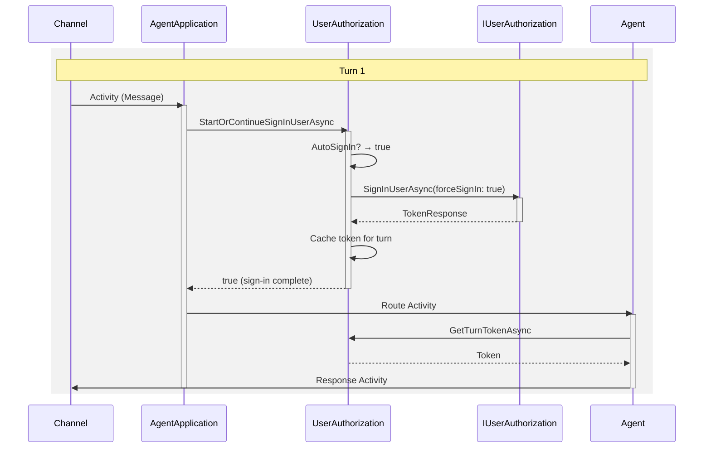
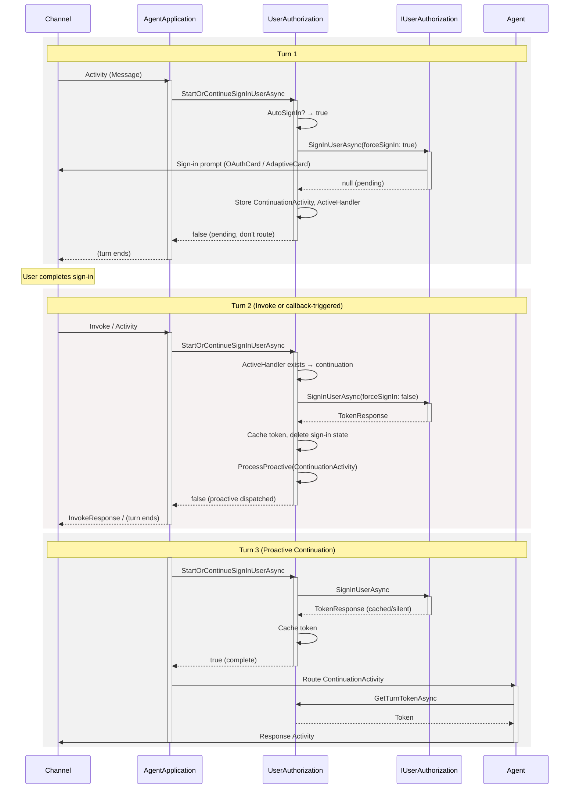
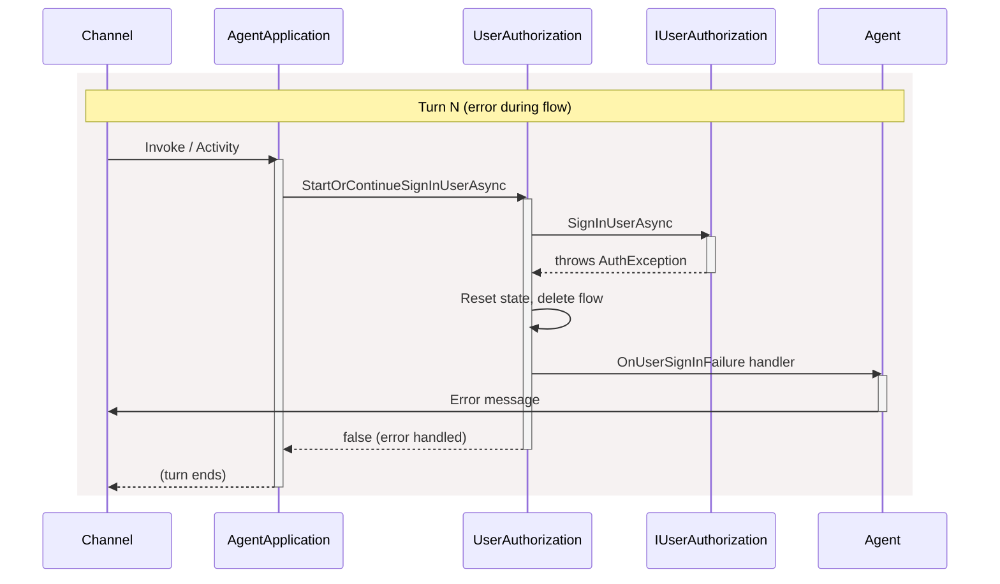

# UserAuthorization and IUserAuthorization — High Level Sequence

- **Teams** is the Teams backend (or any channel).
- **Agent** is the customer's agent business logic.
- **AgentApplication** is the SDK-provided application framework (routes, middleware).
- **UserAuthorization** is the SDK-provided OAuth orchestration layer (`App.UserAuth.UserAuthorization`).
- **IUserAuthorization** is the pluggable auth handler interface (e.g., `AzureBotUserAuthorization`, `TeamsAgenticAuthorization`).

## Architecture

```
AgentApplication
  └── UserAuthorization (orchestrator)
        └── IUserAuthorizationDispatcher
              └── IUserAuthorization (handler per config entry)
                    ├── AzureBotUserAuthorization (Token Service)
                    ├── TeamsAgenticAuthorization (bot-hosted OAuth)
                    └── ConnectorUserAuthorization (Connector)
```

`UserAuthorization` manages:
- Auto sign-in decision (via `AutoSignInSelector`)
- Flow state persistence (active handler, continuation activity)
- Token caching for the turn
- Sign-in failure handling
- Proactive continuation after multi-turn flows

`IUserAuthorization` implementations handle:
- Acquiring tokens (interactive or silent)
- Provider-specific protocols (Token Service, MSAL, etc.)
- Sign-out / cache invalidation

## Auto SignIn — Token Available (single turn)



## Auto SignIn — Multi-Turn Flow (token not available)



## Sign-In Failure


