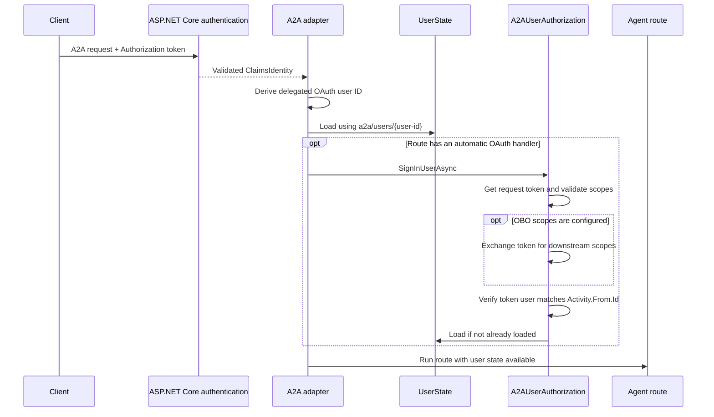
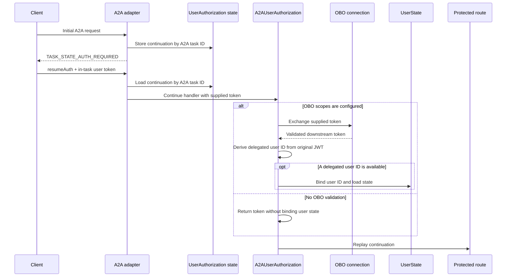

# A2A user state and OAuth flow

The A2A extension makes `ITurnState.User` available only when the request can be
associated with a trusted delegated user identity. An A2A task or calling
application identity is not treated as a user identity.

This document describes how A2A request authentication, OAuth authorization,
and user state interact. For OAuth configuration and token acquisition details,
see the [A2A developer guide](../src/samples/A2A/A2AAgent/A2A-DEVELOPER-GUIDE.md#oauth).

## Core behavior

The adapter leaves `Activity.From.Id` empty when it cannot derive a delegated
user identity. For an A2A activity with no user ID, `UserState.LoadAsync`
returns without loading state so the turn can continue. Reading or writing
`ITurnState.User` on that turn fails with `InvalidOperationException` and the
message `user is not loaded`.

When a trusted delegated identity is available, the adapter assigns a stable
OAuth user ID to `Activity.From.Id`. User state then uses the normal
channel-and-user storage key:

```text
a2a/users/oauth:{issuer}:{tenant-id}:{object-id}
```

If tenant and object ID claims are unavailable, the identity can fall back to:

```text
a2a/users/oauth:{issuer}:{subject}
```

The identity must be authenticated and have evidence that it represents a
delegated user. The extension recognizes delegated scope claims (`scp`,
`scope`, or their mapped claim type) or an `idtyp` claim whose value is `user`.
An application token that contains only `roles` does not bind user state.

This produces the following behavior:

| Request or authorization state | `ITurnState.User` |
| --- | --- |
| Authenticated request with a delegated user identity | Loaded and isolated by the derived OAuth user ID |
| Anonymous request | Unavailable |
| Authenticated application-only request | Unavailable |
| In-task token returned without trusted validation | Unavailable |
| In-task delegated JWT validated by a successful OBO exchange | Loaded before the protected route runs |
| Validated token without a derivable delegated identity, including an opaque token | Unavailable |

## Request-token authorization

In `RequestToken` mode, the standard HTTP `Authorization` header authenticates
the A2A request and carries the token used by `A2AUserAuthorization`.

ASP.NET Core first validates the request token. The A2A adapter then derives the
user ID from the authenticated claims and places it on `Activity.From.Id`
before the agent pipeline loads state. As a result, a valid delegated request
identity makes user state available even when the route does not use an
automatic OAuth handler.

If a route uses `A2AUserAuthorization`, the handler obtains the request token,
optionally validates required delegated scopes, and optionally performs an OBO
exchange. Before returning the token to the authorization pipeline, the
handler verifies that the original token identifies the same user already
bound to the turn. A mismatch fails the turn rather than allowing one identity
to access another identity's state.



## In-task authorization

In `InTask` mode, the first request can reach the agent without a delegated
user identity. When a protected route requires authorization, the A2A task
transitions to `TASK_STATE_AUTH_REQUIRED`. The client acquires a user token and
sends it in the `x-a2a-intask-authorization` header of a `resumeAuth` request.
The standard `Authorization` header continues to authenticate the A2A request.

The authorization flow cannot use a user-keyed continuation record before the
user has been identified. The A2A adapter therefore stores transient
`UserAuthorization` state by task:

```text
oauth/a2a/{task-id}/userAuthorizationState
```

This record is separate from `UserState`. It tracks the active authorization
handler and continuation activity; it does not make user state available.

The client-supplied in-task token is not trusted merely because it was sent to
`resumeAuth`. Without a configured OBO exchange, the handler can return that
token to the route, but it does not use the token to bind user state.

When OBO scopes are configured, a successful OBO exchange establishes trusted
validation of the supplied token. The handler then derives the user ID from
the original delegated JWT, assigns it to `Activity.From.Id`, and loads user
state before replaying the protected route. If the token is opaque or otherwise
does not contain a derivable delegated identity, the authorization flow can
still complete, but user state remains unavailable.



## State isolation and failure behavior

- The A2A task ID scopes transient OAuth continuation state, not user state.
- The delegated OAuth identity scopes user state across A2A tasks. Requests
  from the same issuer, tenant, and object ID share user state; different users
  or tenants do not.
- The original delegated token supplies the user identity. A downstream token
  returned by OBO is not used as the state key.
- `EnforceRequiredScopes` validates authorization requirements but does not by
  itself make an in-task token trusted for user-state binding. In `InTask`
  mode, scope enforcement requires configured OBO scopes.
- If OAuth attempts to bind an identity that differs from the identity already
  present on the turn, the handler throws an `InvalidOperationException`.
- Applications that accept opaque tokens can use those tokens for provider
  APIs, but must not assume `ITurnState.User` is available.

## Route guidance

Use `ITurnState.User` only on routes whose authentication design guarantees a
trusted delegated identity:

- For request-token authorization, require validated delegated authentication
  on the A2A endpoint.
- For in-task authorization, configure a trusted OBO exchange when the route
  needs both the user token and user state.
- Use conversation state, task storage, or another application-defined store
  when the route supports anonymous, application-only, or opaque-token callers.
