# SDK Architecture

This document answers two different questions:

1. **What happens at runtime?** Follow the request and response arrows in the first diagram.
2. **Which packages depend on which other packages?** Follow the `depends on` arrows in the second diagram.

Keeping those meanings separate prevents a runtime call from being mistaken for a compile-time package dependency.

## Runtime Flow

```mermaid
flowchart LR
    Channel["Channel or client<br/>(Teams, Web Chat, Bot Service, another agent)"]
    PipeClient["DirectLineFlex sidecar"]

    subgraph Host["Transport and hosting"]
        AspNet["Microsoft.Agents.Hosting.AspNetCore<br/><i>HTTP endpoints, CloudAdapter</i>"]
        Pipes["Microsoft.Agents.Hosting.DirectLine.NamedPipes<br/><i>named-pipe transport</i>"]
    end

    subgraph App["Agent turn"]
        Builder["Microsoft.Agents.Builder<br/><i>AgentApplication, routing, middleware,<br/>ITurnContext, ITurnState</i>"]
        Extension["Optional platform extension<br/><i>MSTeams, A2A, SharePoint, Slack</i>"]
        AgentCode["Application handlers<br/><i>customer code</i>"]
    end

    subgraph Services["State and outbound services"]
        Storage["IStorage implementation"]
        Connector["Microsoft.Agents.Connector<br/><i>Bot Service channel operations</i>"]
        AgentClient["Microsoft.Agents.Client<br/><i>Activity Protocol agent client/host</i>"]
        CopilotClient["Microsoft.Agents.CopilotStudio.Client"]
        Auth["Microsoft.Agents.Authentication<br/>plus an authentication provider"]
    end

    Channel -->|"HTTP Activity"| AspNet
    PipeClient -->|"framed Activity"| Pipes
    AspNet -->|"creates a turn"| Builder
    Pipes -->|"calls IChannelAdapter.ProcessActivityAsync"| Builder
    Builder -->|"dispatches matching route"| Extension
    Extension -->|"invokes registered handler"| AgentCode
    Builder -->|"dispatches base route"| AgentCode
    Builder <-->|"load/save turn state"| Storage
    AgentCode -->|"send/reply"| Connector
    AgentCode -->|"call another Activity Protocol agent"| AgentClient
    AgentCode -->|"call Copilot Studio"| CopilotClient
    Connector -->|"acquire service or user token"| Auth
    AgentClient -->|"acquire service token"| Auth
    Connector -->|"outbound Activity"| Channel
```

### Runtime Invariants

- `AgentApplication` and middleware live in **Builder**. Hosting creates the turn; Builder runs it.
- The named-pipe transport depends on the ASP.NET Core hosting package for shared hosting components, but its runtime handler bypasses HTTP and calls the channel adapter directly.
- Extensions add routes and platform behavior to an agent application. **Builder does not depend on extensions.**
- `IStorage` is used by Builder for turn state and features such as user authorization and proactive conversation references.
- Channel replies normally use `Microsoft.Agents.Connector`. Synchronous `Invoke`, `ExpectReplies`, and `DeliveryMode.Stream` responses can instead be returned by the host on the inbound HTTP response.
- Authentication is split between the abstractions/configuration package (`Microsoft.Agents.Authentication`) and providers such as `Microsoft.Agents.Authentication.Msal`.

## Package Dependency Graph

Every arrow below means **the package at the tail has a project reference to the package at the arrowhead**. Transitive dependencies and analyzer-only references are omitted unless they explain an important boundary.

```mermaid
flowchart TD
    Core["Microsoft.Agents.Core"]
    Authentication["Microsoft.Agents.Authentication"]
    Msal["Microsoft.Agents.Authentication.Msal"]
    EntraSidecar["Microsoft.Agents.Authentication.EntraAuthSidecar"]

    Storage["Microsoft.Agents.Storage"]
    StorageTranscript["Microsoft.Agents.Storage.Transcript"]
    StorageBlobs["Microsoft.Agents.Storage.Blobs"]
    StorageCosmos["Microsoft.Agents.Storage.CosmosDb"]

    Connector["Microsoft.Agents.Connector"]
    Builder["Microsoft.Agents.Builder"]
    Client["Microsoft.Agents.Client"]
    CopilotStudio["Microsoft.Agents.CopilotStudio.Client"]
    Dialogs["Microsoft.Agents.Builder.Dialogs"]

    AspNet["Microsoft.Agents.Hosting.AspNetCore"]
    NamedPipes["Microsoft.Agents.Hosting.DirectLine.NamedPipes"]

    MSTeams["Microsoft.Agents.Extensions.MSTeams<br/><i>current Teams extension</i>"]
    LegacyTeams["Microsoft.Agents.Extensions.Teams<br/><i>legacy extension</i>"]
    A2A["Microsoft.Agents.Extensions.A2A"]
    SharePoint["Microsoft.Agents.Extensions.SharePoint"]
    Slack["Microsoft.Agents.Extensions.Slack"]

    Authentication -->|"depends on"| Core
    Msal -->|"depends on"| Authentication
    EntraSidecar -->|"depends on"| Authentication

    Storage -->|"depends on"| Core
    StorageTranscript -->|"depends on"| Core
    StorageBlobs -->|"depends on"| Storage
    StorageCosmos -->|"depends on"| Storage

    Connector -->|"depends on"| Authentication
    Connector -->|"depends on"| Core
    Builder -->|"depends on"| Connector
    Builder -->|"depends on"| Authentication
    Builder -->|"depends on"| Core
    Builder -->|"depends on"| Storage
    Builder -->|"depends on"| StorageTranscript

    Client -->|"depends on"| Builder
    Client -->|"depends on"| Authentication
    Client -->|"depends on"| Core
    Client -->|"depends on"| Storage
    CopilotStudio -->|"depends on"| Core
    Dialogs -->|"depends on"| Client
    Dialogs -->|"depends on"| Builder

    AspNet -->|"depends on"| Builder
    NamedPipes -->|"depends on"| AspNet

    MSTeams -->|"depends on"| Builder
    MSTeams -->|"depends on"| Connector
    MSTeams -->|"depends on"| Core
    LegacyTeams -->|"depends on"| Builder
    LegacyTeams -->|"depends on"| Connector
    LegacyTeams -->|"depends on"| Core
    A2A -->|"depends on"| AspNet
    SharePoint -->|"depends on"| Builder
    SharePoint -->|"depends on"| Core
    Slack -->|"depends on"| Builder
    Slack -->|"depends on"| Core
```

## Package Responsibilities

| Area | Primary packages | Responsibility |
|------|------------------|----------------|
| **Core protocol** | `Microsoft.Agents.Core` | Activity Protocol models, serialization, telemetry primitives |
| **Authentication** | `Microsoft.Agents.Authentication`, `.Msal`, `.EntraAuthSidecar` | Connection configuration and token acquisition providers |
| **Builder** | `Microsoft.Agents.Builder` | Agent application, routing, middleware, turn context/state, user authorization, proactive messaging, streaming |
| **Hosting** | `Microsoft.Agents.Hosting.AspNetCore`, `.DirectLine.NamedPipes` | Inbound transports and endpoint integration |
| **Clients** | `Microsoft.Agents.Connector`, `.Client`, `.CopilotStudio.Client` | Bot Service/channel operations and outbound agent clients |
| **Extensions** | `.MSTeams`, `.A2A`, `.SharePoint`, `.Slack` | Platform- or protocol-specific routes and capabilities |
| **Storage** | `.Storage`, `.Storage.Blobs`, `.Storage.CosmosDb`, `.Storage.Transcript` | State and transcript persistence |

## Source of Truth

- Package dependencies: `src/libraries/**/*.csproj`
- Runtime HTTP pipeline: `src/libraries/Hosting/AspNetCore/CloudAdapter.cs`
- Turn pipeline: `src/libraries/Builder/Microsoft.Agents.Builder/ChannelAdapter.cs`
- Agent routing: `src/libraries/Builder/Microsoft.Agents.Builder/App/AgentApplication.cs`

This is a package-level map, not a complete class diagram. External NuGet dependencies, test helpers, and Roslyn analyzer projects are intentionally omitted from the diagrams.
