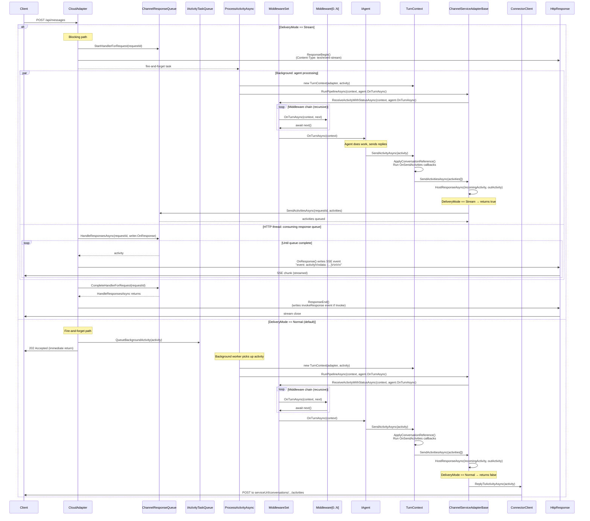

# CloudAdapter Pipeline Sequence Diagram

Shows the interaction between `CloudAdapter.ProcessAsync`, the middleware pipeline, `ITurnContext.SendActivityAsync`, and `IAgent` — including both response paths.

## Response Paths

- **Normal delivery**: `HostResponseAsync` returns `false` → response sent via `ConnectorClient` (Azure Bot Service pushes to client)
- **Stream delivery**: `HostResponseAsync` returns `true` → response queued into `ChannelResponseQueue` → HTTP thread writes SSE events directly to `HttpResponse.Body`

## Diagram

## Key Components

| Component | Location |
|-----------|----------|
| `CloudAdapter` | `src/libraries/Hosting/AspNetCore/CloudAdapter.cs` |
| `ChannelResponseQueue` | `src/libraries/Hosting/AspNetCore/ChannelResponseQueue.cs` |
| `ActivityResponseHandler` (SSE writer) | `src/libraries/Hosting/AspNetCore/ActivityResponseHandler.cs` |
| `ChannelServiceAdapterBase` | `src/libraries/Builder/Microsoft.Agents.Builder/ChannelServiceAdapterBase.cs` |
| `TurnContext` | `src/libraries/Builder/Microsoft.Agents.Builder/TurnContext.cs` |
| `MiddlewareSet` | `src/libraries/Builder/Microsoft.Agents.Builder/MiddlewareSet.cs` |

## ChannelResponseQueue — Producer/Consumer Bridge

In the Stream path, `ChannelResponseQueue` acts as a thread-safe bridge between the background agent processing thread and the HTTP response thread:

- **Producer**: background agent thread calls `SendActivitiesAsync()` → writes activities to an unbounded `Channel<IActivity>`
- **Consumer**: HTTP request thread calls `HandleResponsesAsync()` → reads activities and passes them to `ActivityResponseHandler.OnResponse()`, which writes SSE events to `HttpResponse.Body`
- **Completion**: when `ProcessActivityAsync` finishes, `CloudAdapter` calls `CompleteHandlerForRequest()` → closes the channel writer → consumer loop exits → `ResponseEnd()` is called
