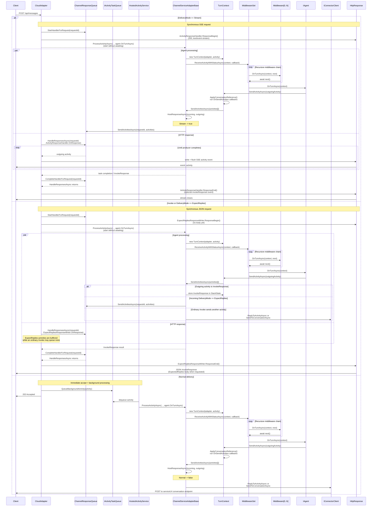

# CloudAdapter Pipeline Sequence Diagram

Shows how `CloudAdapter.ProcessAsync` chooses the HTTP lifetime, runs the Builder middleware pipeline, and routes outgoing activities. The incoming activity type and delivery mode determine whether the HTTP request returns immediately or remains open.

## Request Modes

| Incoming request | HTTP behavior | Outgoing activity behavior |
|------------------|---------------|----------------------------|
| Normal activity | Return `202 Accepted` after enqueueing work in `IActivityTaskQueue` | `HostResponseAsync` returns `false`; `ChannelServiceAdapterBase` sends through `IConnectorClient` |
| `DeliveryMode.Stream` | Keep HTTP open and write Server-Sent Events (SSE) | `HostResponseAsync` queues activities in `ChannelResponseQueue`; `ActivityResponseHandler` writes each activity event |
| `DeliveryMode.ExpectReplies` | Keep HTTP open and return one JSON response | `HostResponseAsync` queues activities; `ExpectRepliesResponseWriter` buffers them into `ExpectedReplies` |
| Invoke with neither `Stream` nor `ExpectReplies` | Keep HTTP open and return the final `InvokeResponse` as JSON | `InvokeResponse` is stored in turn stack state; other outgoing activities still use `IConnectorClient` |

## Diagram

```mermaid
sequenceDiagram
    participant Client
    participant CloudAdapter
    participant ResponseQueue as ChannelResponseQueue
    participant ActivityQueue as IActivityTaskQueue
    participant HostedService as HostedActivityService
    participant AdapterBase as ChannelServiceAdapterBase
    participant TurnContext
    participant MiddlewareSet
    participant Middleware as Middleware[0..N]
    participant IAgent
    participant ConnectorClient as IConnectorClient
    participant HttpResponse

    Client->>CloudAdapter: POST /api/messages

    alt DeliveryMode == Stream
        Note over CloudAdapter,HttpResponse: Synchronous SSE request
        CloudAdapter->>ResponseQueue: StartHandlerForRequest(requestId)
        CloudAdapter->>HttpResponse: ActivityResponseHandler.ResponseBegin()<br/>(200, text/event-stream)
        CloudAdapter-->>AdapterBase: ProcessActivityAsync(..., agent.OnTurnAsync)<br/>(start without awaiting)

        par Agent processing
            AdapterBase->>TurnContext: new TurnContext(adapter, activity)
            AdapterBase->>MiddlewareSet: ReceiveActivityWithStatusAsync(context, callback)
            loop Recursive middleware chain
                MiddlewareSet->>Middleware: OnTurnAsync(context, next)
                Middleware->>MiddlewareSet: await next()
            end
            MiddlewareSet->>IAgent: OnTurnAsync(context)
            IAgent->>TurnContext: SendActivityAsync(outgoingActivity)
            TurnContext->>TurnContext: ApplyConversationReference()<br/>run OnSendActivities callbacks
            TurnContext->>AdapterBase: SendActivitiesAsync(activities[])
            AdapterBase->>AdapterBase: HostResponseAsync(incoming, outgoing)
            Note over AdapterBase: Stream -> true
            AdapterBase->>ResponseQueue: SendActivitiesAsync(requestId, activities)
        and HTTP response
            CloudAdapter->>ResponseQueue: HandleResponsesAsync(requestId,<br/>ActivityResponseHandler.OnResponse)
            loop Until producer completes
                ResponseQueue-->>CloudAdapter: outgoing activity
                CloudAdapter->>HttpResponse: write + flush SSE activity event
                HttpResponse->>Client: event: activity
            end
        end

        AdapterBase-->>CloudAdapter: task completion / InvokeResponse
        CloudAdapter->>ResponseQueue: CompleteHandlerForRequest(requestId)
        ResponseQueue-->>CloudAdapter: HandleResponsesAsync returns
        CloudAdapter->>HttpResponse: ActivityResponseHandler.ResponseEnd()<br/>(optional invokeResponse event)
        HttpResponse->>Client: stream closes

    else Invoke or DeliveryMode == ExpectReplies
        Note over CloudAdapter,HttpResponse: Synchronous JSON request
        CloudAdapter->>ResponseQueue: StartHandlerForRequest(requestId)
        CloudAdapter->>HttpResponse: ExpectRepliesResponseWriter.ResponseBegin()<br/>(no body yet)
        CloudAdapter-->>AdapterBase: ProcessActivityAsync(..., agent.OnTurnAsync)<br/>(start without awaiting)

        par Agent processing
            AdapterBase->>TurnContext: new TurnContext(adapter, activity)
            AdapterBase->>MiddlewareSet: ReceiveActivityWithStatusAsync(context, callback)
            loop Recursive middleware chain
                MiddlewareSet->>Middleware: OnTurnAsync(context, next)
                Middleware->>MiddlewareSet: await next()
            end
            MiddlewareSet->>IAgent: OnTurnAsync(context)
            IAgent->>TurnContext: SendActivityAsync(outgoingActivity)
            TurnContext->>AdapterBase: SendActivitiesAsync(activities[])

            alt Outgoing activity is InvokeResponse
                AdapterBase->>TurnContext: store InvokeResponse in StackState
            else Incoming DeliveryMode == ExpectReplies
                AdapterBase->>ResponseQueue: SendActivitiesAsync(requestId, activities)
            else Ordinary Invoke sends another activity
                AdapterBase->>ConnectorClient: ReplyToActivityAsync or<br/>SendToConversationAsync
            end
        and HTTP response
            CloudAdapter->>ResponseQueue: HandleResponsesAsync(requestId,<br/>ExpectRepliesResponseWriter.OnResponse)
            Note over CloudAdapter: ExpectReplies activities are buffered<br/>while an ordinary Invoke may queue none
        end

        AdapterBase-->>CloudAdapter: InvokeResponse result
        CloudAdapter->>ResponseQueue: CompleteHandlerForRequest(requestId)
        ResponseQueue-->>CloudAdapter: HandleResponsesAsync returns
        CloudAdapter->>HttpResponse: ExpectRepliesResponseWriter.ResponseEnd()
        HttpResponse->>Client: JSON InvokeResponse<br/>(ExpectedReplies body when requested)

    else Normal delivery
        Note over CloudAdapter,HostedService: Immediate accept + background processing
        CloudAdapter->>ActivityQueue: QueueBackgroundActivity(activity)
        CloudAdapter->>Client: 202 Accepted

        HostedService->>ActivityQueue: dequeue activity
        HostedService->>AdapterBase: ProcessActivityAsync(..., agent.OnTurnAsync)
        AdapterBase->>TurnContext: new TurnContext(adapter, activity)
        AdapterBase->>MiddlewareSet: ReceiveActivityWithStatusAsync(context, callback)

        loop Recursive middleware chain
            MiddlewareSet->>Middleware: OnTurnAsync(context, next)
            Middleware->>MiddlewareSet: await next()
        end

        MiddlewareSet->>IAgent: OnTurnAsync(context)
        IAgent->>TurnContext: SendActivityAsync(outgoingActivity)
        TurnContext->>TurnContext: ApplyConversationReference()<br/>run OnSendActivities callbacks
        TurnContext->>AdapterBase: SendActivitiesAsync(activities[])
        AdapterBase->>AdapterBase: HostResponseAsync(incoming, outgoing)
        Note over AdapterBase: Normal -> false
        AdapterBase->>ConnectorClient: ReplyToActivityAsync or<br/>SendToConversationAsync
        ConnectorClient->>Client: POST to serviceUrl conversation endpoint
    end
```

## Key Components

| Component | Location |
|-----------|----------|
| `CloudAdapter` | `src/libraries/Hosting/AspNetCore/CloudAdapter.cs` |
| `ChannelResponseQueue` | `src/libraries/Hosting/AspNetCore/ChannelResponseQueue.cs` |
| `ActivityResponseHandler` (SSE writer) | `src/libraries/Hosting/AspNetCore/ActivityResponseHandler.cs` |
| `ExpectRepliesResponseWriter` (JSON writer) | `src/libraries/Hosting/AspNetCore/ExpectRepliesResponseWriter.cs` |
| `IActivityTaskQueue` / `HostedActivityService` | `src/libraries/Hosting/AspNetCore/BackgroundQueue/` |
| `ChannelServiceAdapterBase` | `src/libraries/Builder/Microsoft.Agents.Builder/ChannelServiceAdapterBase.cs` |
| `TurnContext` | `src/libraries/Builder/Microsoft.Agents.Builder/TurnContext.cs` |
| `MiddlewareSet` | `src/libraries/Builder/Microsoft.Agents.Builder/MiddlewareSet.cs` |

## ChannelResponseQueue Producer/Consumer Bridge

In the Stream and ExpectReplies paths, `ChannelResponseQueue` bridges agent processing and the open HTTP response:

- **Producer**: `ChannelServiceAdapterBase.SendActivitiesAsync` calls the `CloudAdapter.HostResponseAsync` override, which writes hosted activities to an unbounded `Channel<IActivity>`.
- **Consumer**: the HTTP request thread runs `HandleResponsesAsync`, passing activities to either `ActivityResponseHandler.OnResponse` (SSE) or `ExpectRepliesResponseWriter.OnResponse` (buffered JSON).
- **Completion**: the continuation attached to `ProcessActivityAsync` calls `CompleteHandlerForRequest` after processing ends. The writer is completed, the consumer drains remaining activities, and only then does `ResponseEnd` write the final protocol response.

## Scope and Invariants

- Normal requests are processed later by `HostedActivityService`; synchronous requests call `ProcessActivityAsync` directly.
- `ChannelAdapter.RunPipelineAsync` calls `MiddlewareSet.ReceiveActivityWithStatusAsync`; middleware recursively calls `next()`, ending at `IAgent.OnTurnAsync`.
- `ChannelServiceAdapterBase.SendActivitiesAsync` handles `InvokeResponse` and trace activities before consulting `HostResponseAsync`.
- `HostResponseAsync` returns `true` for both Stream and ExpectReplies. The response writer, not the queue, determines SSE versus JSON formatting.
- Authentication and connector-client construction are omitted so request lifetime and response routing remain visible.
