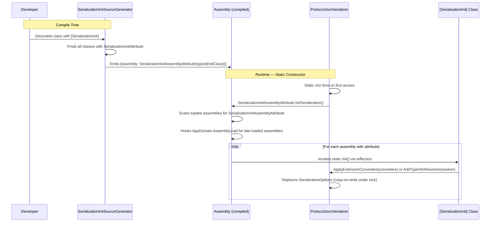
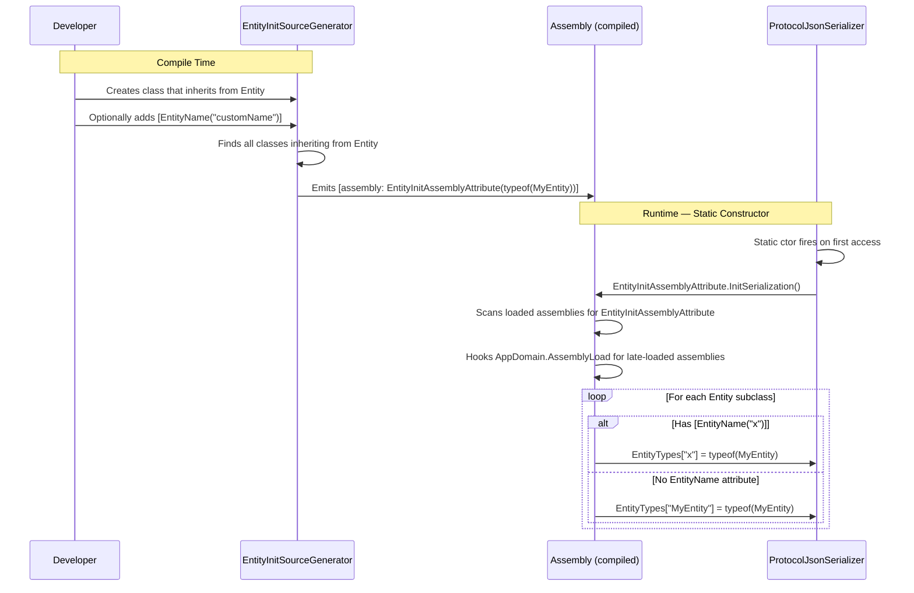
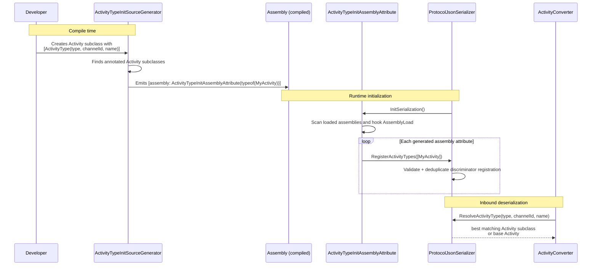
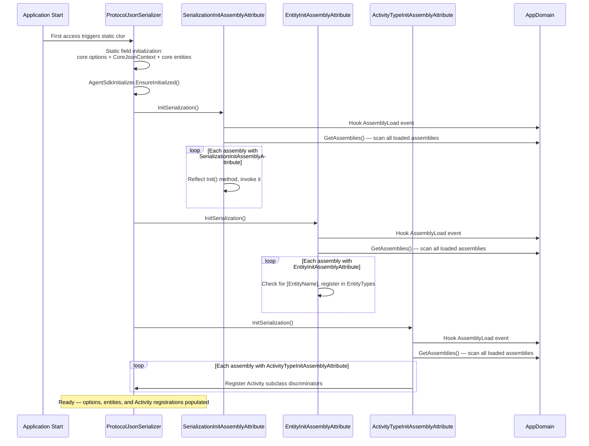

# Serialization Extension Sequence Diagram

Shows how the SDK discovers and registers serialization extensions (custom converters, type resolvers, `Entity` subclasses, and `Activity` subclasses) by using assembly-level attributes generated at build time by Roslyn source generators and scanned at runtime.

## Participants

- **Developer** — Authors a library or extension that adds custom serialization (converters, entities).
- **Source Generators** — Compile-time Roslyn source generators that emit assembly attributes.
- **Assembly Attributes** — Generated `[assembly: ...]` markers that the runtime scans.
- **ProtocolJsonSerializer** — The central static serializer that owns `SerializationOptions`, `EntityTypes`, and custom Activity resolution registrations.

## Three Extension Paths

| Path | Purpose | Developer Action | Generated Attribute | Runtime Effect |
|------|---------|-----------------|---------------------|----------------|
| **Serialization Init** | Register converters / resolvers | Decorate a class with `[SerializationInit]`, add a `public static void Init()` method | `SerializationInitAssemblyAttribute` | `Init()` is called → class calls `ApplyExtensionConverters` or `AddTypeInfoResolver` |
| **Entity Init** | Register Entity subclasses for polymorphic deserialization | Subclass `Entity`; optionally add `[EntityName("name")]` | `EntityInitAssemblyAttribute` | Type is registered in `EntityTypes` dictionary |
| **Activity Type Init** | Register Activity subclasses using wire discriminators | Subclass `Activity`; add one or more `[ActivityType(...)]` attributes | `ActivityTypeInitAssemblyAttribute` | Type and its `type` / `channelId` / `name` discriminators are registered for inbound Activity resolution |

## Serialization Init Flow



## Entity Init Flow



## Activity Type Init Flow



## Combined Initialization Sequence



## Developer Usage Examples

### Adding Custom Converters (e.g., SharePoint extension)

```csharp
[SerializationInit]
internal class SerializationInit
{
    public static void Init()
    {
        var converters = new List<JsonConverter>
        {
            new AceDataConverter(),
            new AceRequestConverter()
        };
        ProtocolJsonSerializer.ApplyExtensionConverters(converters);
    }
}
```

### Adding a Custom Entity

```csharp
[EntityName("clientInfo")]
public class ClientInfo : Entity
{
    public const string EntityName = "clientInfo";
    public ClientInfo() : base(EntityName) { }

    public string? Locale { get; set; }
    public string? Country { get; set; }
}
```

No explicit registration code is needed — the source generator detects the `Entity` subclass at compile time and the runtime registers it automatically.

### Adding a Source-Generated JsonSerializerContext

```csharp
[SerializationInit]
internal class SerializationInit
{
    public static void Init()
    {
        ProtocolJsonSerializer.AddTypeInfoResolver(MyExtensionJsonContext.Default);
    }
}
```

### Adding a Custom Activity Type

```csharp
[ActivityType(ActivityTypes.Event, Name = "contoso/orderUpdated")]
public class OrderUpdatedActivity : Activity
{
    public string? OrderId { get; set; }
}
```

The source generator emits the assembly registration. During inbound deserialization, the SDK selects the most specific matching registration using the declared `type`, `channelId`, and `name` discriminators.

## Key Design Points

- **Compile-time discovery** — Source generators run during build, eliminating reflection-heavy type scanning at startup.
- **Late-loading support** — `AppDomain.AssemblyLoad` hook ensures assemblies loaded after initial startup (common with lazy-loaded NuGet packages) are also initialized.
- **Copy-on-write thread safety** — `ProtocolJsonSerializer` replaces `SerializationOptions` atomically under a lock; concurrent readers never see a partially-mutated instance.
- **Entity polymorphism** — `EntityConverter` uses the `EntityTypes` dictionary to deserialize `Entity` objects to their concrete types based on the `type` field in JSON.
- **Activity polymorphism** — `ActivityConverter` consults registrations created from `[ActivityType]`; the base `Activity` remains the fallback when no registration matches.
- **No manual registration** — Developers add `[SerializationInit]`, inherit from `Entity`, or annotate an `Activity` subclass with `[ActivityType]`; the generators and runtime handle normal wiring.

## Related Source Files

| Component | Path |
|-----------|------|
| `ProtocolJsonSerializer` | `src/libraries/Core/Microsoft.Agents.Core/Serialization/ProtocolJsonSerializer.cs` |
| Serialization init generator | `src/libraries/Core/Microsoft.Agents.Core.Analyzers/SerializationInitSourceGenerator.cs` |
| Entity init generator | `src/libraries/Core/Microsoft.Agents.Core.Analyzers/EntityInitSourceGenerator.cs` |
| Activity type generator | `src/libraries/Core/Microsoft.Agents.Core.Analyzers/ActivityTypeInitSourceGenerator.cs` |
| Runtime assembly attributes | `src/libraries/Core/Microsoft.Agents.Core/Serialization/*InitAssemblyAttribute.cs` |
| `EntityConverter` / `ActivityConverter` | `src/libraries/Core/Microsoft.Agents.Core/Serialization/Converters/` |
