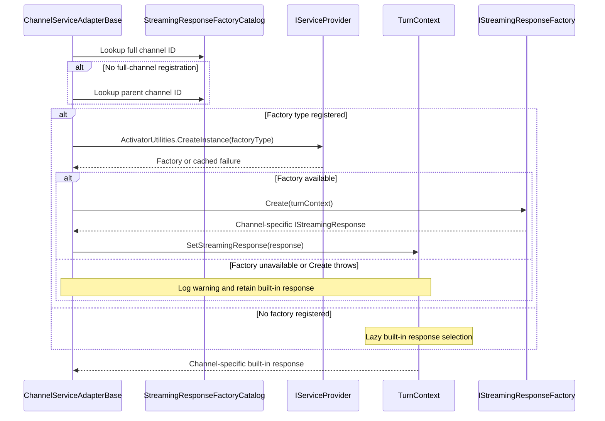
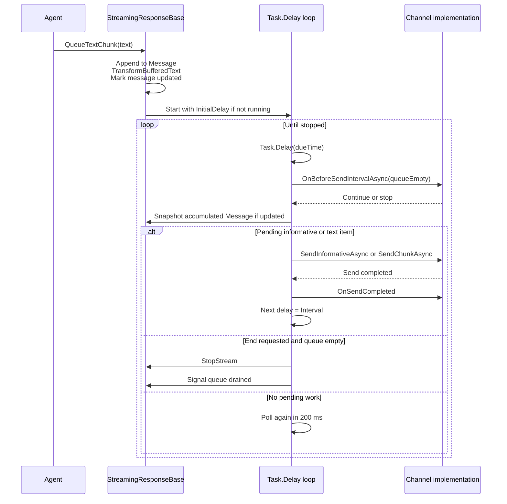
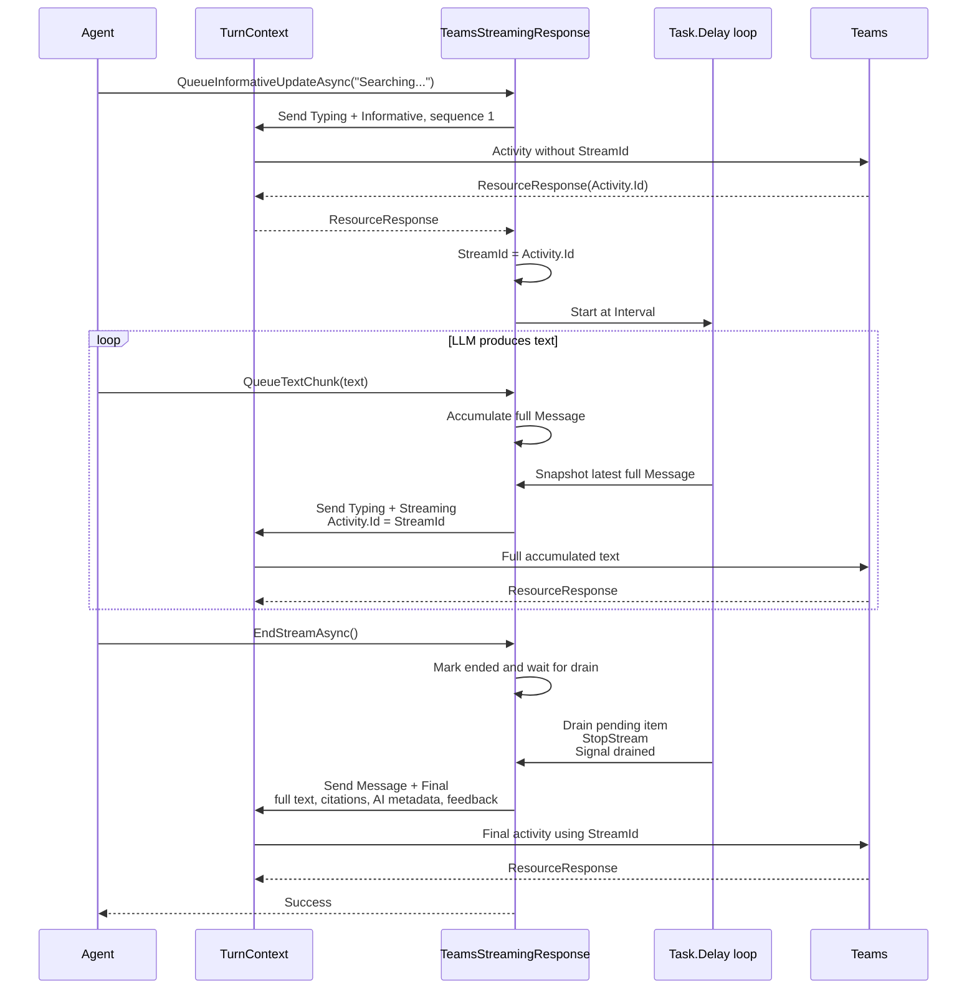
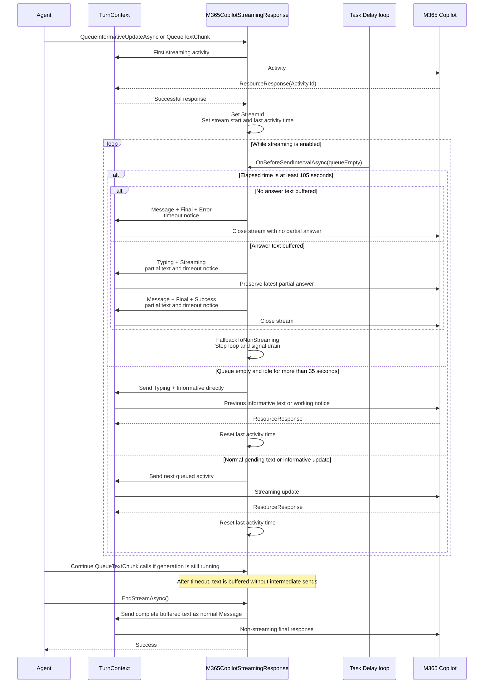
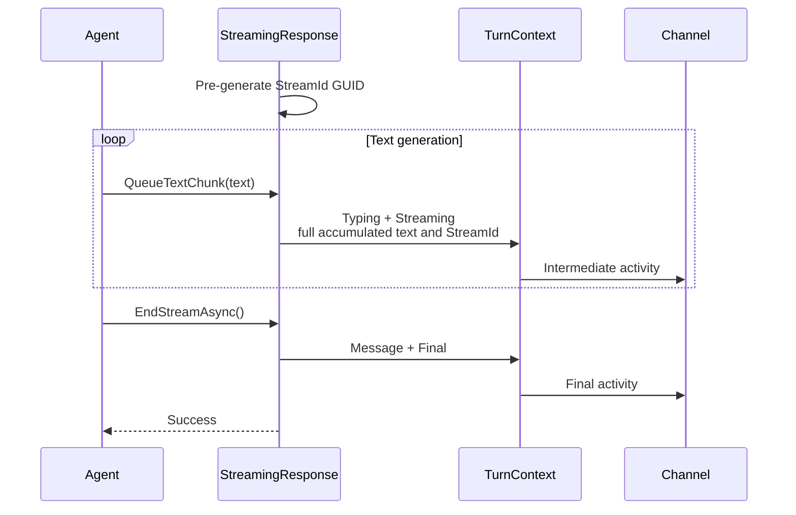
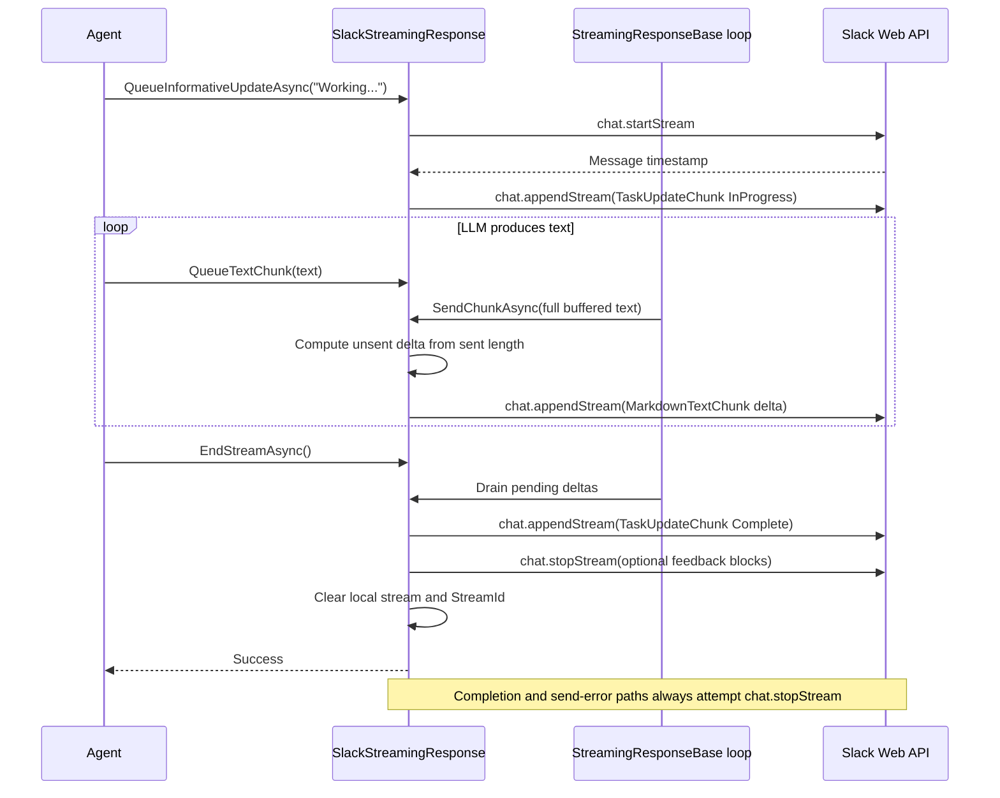
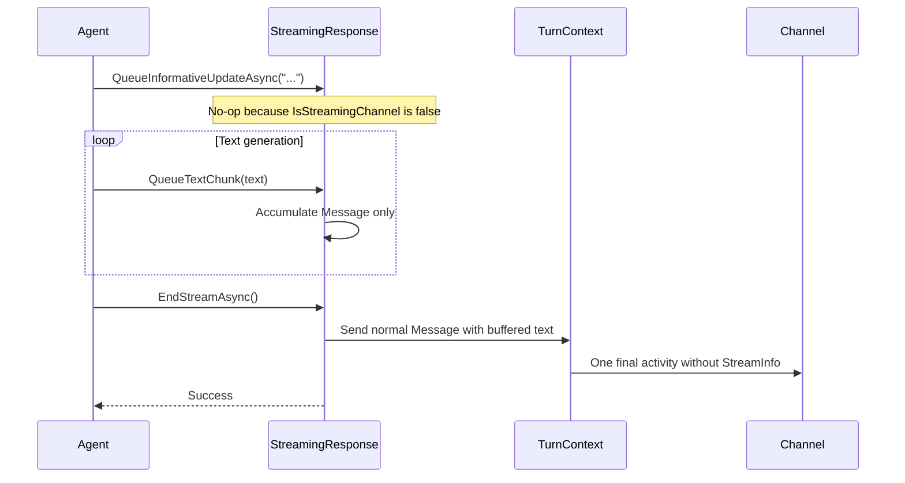

# Streaming Response Sequence Diagrams

`ITurnContext.StreamingResponse` provides one API for Activity Protocol streaming and channel-native
streaming implementations. `StreamingResponseBase` owns buffering, sequencing, the asynchronous interval
loop, end/reset behavior, and error actions. `StreamingResponse` provides the shared Activity Protocol
format, while channel specializations provide defaults, metadata, and error handling.

## Response Selection

`ChannelServiceAdapterBase` checks the full channel ID first (for example, `msteams:COPILOT`) and then the
parent channel ID. A discovered factory is instantiated through dependency injection and cached by factory
type. If discovery or creation fails, `TurnContext` uses its built-in response:

- `M365CopilotStreamingResponse` for `msteams:COPILOT`.
- `TeamsStreamingResponse` for Teams and other Teams subchannels.
- `StreamingResponse` for all other channels.

## Channel Defaults

| Channel | Implementation | Interval | Stream identity | Special behavior |
|---|---|---:|---|---|
| Teams | `TeamsStreamingResponse` | 1000 ms | First response `Activity.Id` | Teams-specific errors and feedback metadata |
| M365 Copilot (`msteams:COPILOT`) | `M365CopilotStreamingResponse` | 1000 ms | First response `Activity.Id` | Teams behavior plus 35-second idle notice and 105-second streaming cutoff |
| WebChat / DirectLine | `StreamingResponse` | 500 ms | Pre-generated GUID | Full accumulated text per update |
| `DeliveryModes.Stream` | `StreamingResponse` | 100 ms | Pre-generated GUID | Activity Protocol streaming over the host transport |
| Slack | `SlackStreamingResponse` | 200 ms | Slack stream plus local GUID | Appends text deltas through Slack `chat.*Stream` APIs |
| Other / `ExpectReplies` | `StreamingResponse` | N/A | N/A | Buffers and sends one normal final message |

`InitialDelay` defaults to 250 ms. Slack can override `Interval` and `InitialDelay` through
`Slack:Streaming` configuration.

## Shared `StreamingResponseBase` Loop

The previous `System.Threading.Timer` callback is replaced by a single asynchronous `Task.Delay` loop.
Only one send can be active at a time. Informative updates and buffered text snapshots share one FIFO queue.

`StopStream` runs before the drain signal is set, so `EndStreamAsync` cannot return while
`IsStreamStarted()` still reports `true`.

## Teams Flow

Teams assigns the stream ID. The first successful send returns an `Activity.Id`; every later streaming
activity uses that value as both `Activity.Id` and `StreamInfo.StreamId`.

## M365 Copilot Flow

`M365CopilotStreamingResponse` derives from `TeamsStreamingResponse`, retaining Teams stream identity,
error handling, and final-message metadata while adding separate lifecycle requirements:

- The 105-second cutoff begins after the first successful send.
- Successful informative and text sends reset the 35-second inactivity clock.
- An idle keep-alive is sent directly by the current loop iteration. It reuses the most recent informative
  text, or `StreamingTakingTooLongMessage` if none exists.
- At the cutoff, the streaming transport is closed and the response falls back to normal delivery. Content
  generation can continue, and `EndStreamAsync` later sends the complete buffered response as a normal message.

If the agent finishes before the cutoff, `EndStreamAsync` follows the normal Teams finalization path and
sends a `StreamTypes.Final` activity.

## WebChat, DirectLine, and `DeliveryModes.Stream`

These channels use the same accumulated-text behavior as Teams, but the response creates a GUID before the
first send instead of adopting the first `ResourceResponse.Id`.

## Slack Native Streaming

The Slack extension registers `SlackStreamingResponseFactory` for the Slack channel. The factory is
discovered automatically and creates `SlackStreamingResponse` with its `SlackApi` dependency.

Unlike Activity Protocol channels, Slack appends only the new text delta.

## Non-Streaming Flow

For unsupported channels and `DeliveryMode.ExpectReplies`, informative updates are ignored, text is buffered,
and no interval loop starts.

## Error Actions

`StreamingResponseBase` asks the implementation to map a send exception to one of three actions:

| Action | Base behavior |
|---|---|
| `Continue` | Drop the failed send and continue the interval loop |
| `FallbackToNonStreaming` | Disable intermediate streaming, stop the loop, and allow a normal final message |
| `Cancel` | Stop the loop; `EndStreamAsync` returns `Error` or `UserCancelled` |

`TeamsStreamingResponse` applies these Teams service policies:

- `ContentStreamNotAllowed` caused by user cancellation returns `UserCancelled`.
- `ContentStreamNotAllowed` with the exceeded-time message updates the existing activity and falls back to
  non-streaming delivery.
- `BadArgument` with `streaming api is not enabled` falls back to non-streaming delivery.
- Other failures cancel the stream.

`StreamingResponse`, used by WebChat, DirectLine, and `DeliveryModes.Stream`, treats send failures as
transport failures and cancels the stream.

Slack attempts `chat.stopStream` before returning `Cancel`, so a remote Slack message is not intentionally
left in progress after an append failure.

## Key Implementation Details

- The interval loop uses `Task.Delay`, not `System.Threading.Timer`.
- Only one send runs at a time; the next delay begins after the current send completes.
- Informative updates and text snapshots are sent in FIFO order.
- Activity Protocol intermediate messages contain the full accumulated text; Slack sends only the new delta.
- `EndStreamTimeout` defaults to two minutes.
- `ResetAsync` ends an active stream, clears buffered and synchronization state, restores shared defaults,
  and invokes the implementation-specific reset hook to restore channel defaults and stream identity.
- Factory lookup checks the full channel ID before the parent ID, enabling subchannel specializations.
- Factory instantiation failures are cached without caching the absence of a registration, so later-loaded
  extension assemblies can still be discovered.

## Related Source Files

| Component | Path |
|---|---|
| Shared streaming loop | `src/libraries/Builder/Microsoft.Agents.Builder/StreamingResponseBase.cs` |
| Activity Protocol implementation | `src/libraries/Builder/Microsoft.Agents.Builder/StreamingResponse.cs` |
| Teams specialization | `src/libraries/Builder/Microsoft.Agents.Builder/TeamsStreamingResponse.cs` |
| M365 Copilot specialization | `src/libraries/Builder/Microsoft.Agents.Builder/M365CopilotStreamingResponse.cs` |
| Streaming response contract | `src/libraries/Builder/Microsoft.Agents.Builder/IStreamingResponse.cs` |
| Factory contract and discovery | `src/libraries/Builder/Microsoft.Agents.Builder/IStreamingResponseFactory.cs` |
| Factory catalog | `src/libraries/Builder/Microsoft.Agents.Builder/StreamingResponseFactoryCatalog.cs` |
| Adapter factory selection | `src/libraries/Builder/Microsoft.Agents.Builder/ChannelServiceAdapterBase.cs` |
| Turn response property | `src/libraries/Builder/Microsoft.Agents.Builder/TurnContext.cs` |
| Slack implementation | `src/libraries/Extensions/Microsoft.Agents.Extensions.Slack/Api/SlackStreamingResponse.cs` |
| Stream entity model | `src/libraries/Core/Microsoft.Agents.Core/Models/StreamInfo.cs` |
