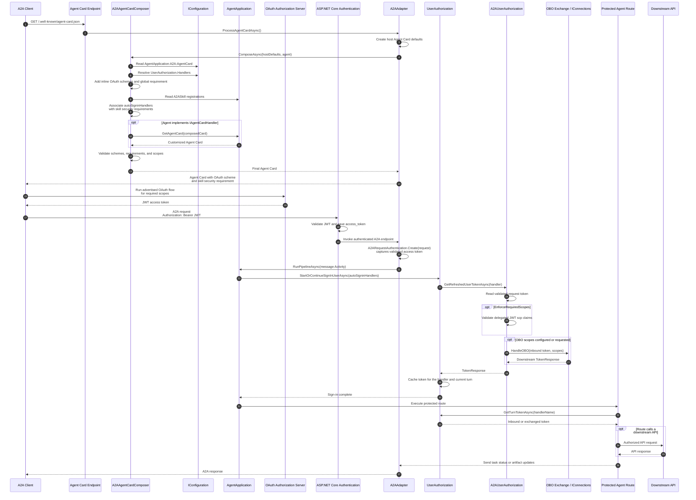

# A2A Agent Card Authorization Sequence Diagram

Shows how Agent Card OAuth metadata is composed, how an A2A client acquires the
advertised token, and how the validated request token enters the standard
`AgentApplication.UserAuthorization` pipeline.

## Diagram

## Key Components

| Component | Location |
| --- | --- |
| Agent Card endpoint registration | `src/libraries/Extensions/Microsoft.Agents.Extensions.A2A/A2AServiceExtensions.cs` |
| `A2AAdapter.ProcessAgentCardAsync` | `src/libraries/Extensions/Microsoft.Agents.Extensions.A2A/Pipeline/A2AAdapter.cs` |
| `A2AAgentCardComposer` | `src/libraries/Extensions/Microsoft.Agents.Extensions.A2A/AgentCard/A2AAgentCardComposer.cs` |
| `A2AAuthorizationMetadata` | `src/libraries/Extensions/Microsoft.Agents.Extensions.A2A/Authorization/A2AAuthorizationMetadata.cs` |
| `A2ARequestAuthentication` | `src/libraries/Extensions/Microsoft.Agents.Extensions.A2A/Authorization/A2ARequestAuthentication.cs` |
| `A2AUserAuthorization` | `src/libraries/Extensions/Microsoft.Agents.Extensions.A2A/Authorization/A2AUserAuthorization.cs` |
| `A2ASkillAttribute` (`autoSigninHandlers`) | `src/libraries/Extensions/Microsoft.Agents.Extensions.A2A/A2ASkillAttribute.cs` |

## Important Behavior

- The handler's inline OAuth flow contributes the Agent Card security scheme;
  `SecuritySchemeName` defaults to the handler name.
- `A2ASkillAttribute.AutoSignInHandlers` associates the authorization handler
  with the skill's security requirement.
- The request carries one authorization token. The built-in path requires a
  token that ASP.NET Core can validate and expose to the A2A handler.
- Use in-task authorization when a route needs multiple user tokens or an
  opaque provider token that cannot use the JWT request-authentication path.
