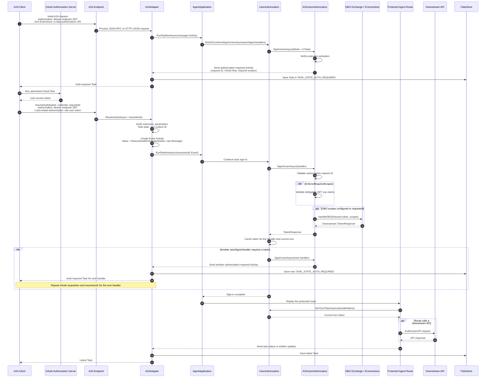

# A2A In-Task Authorization Sequence Diagram

Shows how an A2A task requests a user token after the task has started. The
standard `Authorization` header continues to authenticate the A2A request,
while `x-a2a-intask-authorization` carries the raw user token for `resumeAuth`.

## Diagram

## Key Components

| Component | Location |
| --- | --- |
| `A2AAdapter` (`resumeAuth` validation and Event Activity conversion) | `src/libraries/Extensions/Microsoft.Agents.Extensions.A2A/Pipeline/A2AAdapter.cs` |
| `InTaskAuthorizationExtension` (extension URI and token header) | `src/libraries/Extensions/Microsoft.Agents.Extensions.A2A/ProtocolExtensions/InTaskAuthorization/InTaskAuthorizationExtension.cs` |
| `ResumeAuthEventValue` and request context models | `src/libraries/Extensions/Microsoft.Agents.Extensions.A2A/ProtocolExtensions/InTaskAuthorization/InTaskAuthorizationModels.cs` |
| `A2AUserAuthorization` (auth-required response, token validation, and OBO) | `src/libraries/Extensions/Microsoft.Agents.Extensions.A2A/Authorization/A2AUserAuthorization.cs` |
| `UserAuthorization` (per-handler turn-token cache) | `src/libraries/Builder/Microsoft.Agents.Builder/App/UserAuth/UserAuthorization.cs` |

## Important Behavior

- The endpoint JWT and user token are logically separate credentials.
- The `x-a2a-intask-authorization` value is the raw token, without a `Bearer`
  prefix.
- A task can request additional handlers sequentially, allowing more than one
  user token during the task.
- Opaque user tokens are supported when application-specific validation or
  exchange does not require JWT claims.
