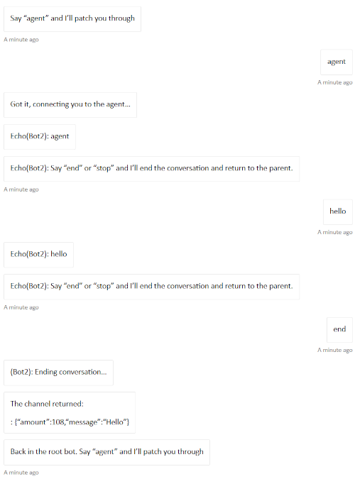

# BotToBot

This Sample contains two bots, Bot1 and Bot2, that represent the two legs of a Bot to Bot communication sequence using Agents SDK.  

## Key concepts in this sample

- The solution includes a parent bot (`Bot1`) and a bot (`Bot2`) and shows how the Bot1 can post activities to the Bot2 and returns the bot responses to the user.

  - [Bot1](Bot1/HostBot.cs): This bot shows how to engage another bot in a multi-turn conversation:
    - How to start a multi-turn conversation with another bot.
    - How to create a new conversationId to use with the other bot.
    - Messages are sent to the other both until an EndOfConversation is sent.
    - How to initiate EndOfConversation with the other bot proactively.  In this sample, if a critical error happens.
  - [Bot2](Bot2/EchoConversationBot.cs): This is a simple bot that receives message activities from the parent bot and echoes what the user said. This project demonstrates:
    - Receives and echo's back the message
    - Sends EndOfConversation when "end" is received, and returns a result to the parent bot.

    
 
- Each bot is setup as would other samples.
  - Setup Bot2 using [README.md](bot2/README.md).  You'll need the ClientId of Bot2, and the local messaging endpoint.
  - Setup Bot1 using [README.md](bot1/README.md)

