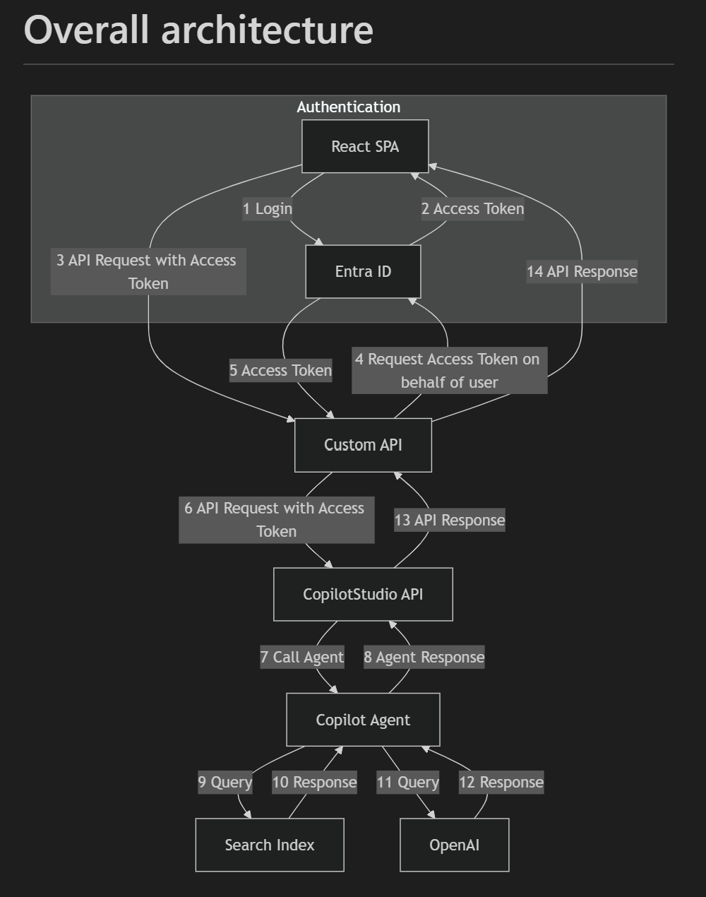

# Copilot Studio Client Sample API

## Architecture

Below is diagram of the overall architecture. This project implements Custom API. The CopilotStudio API is implement with the Microsoft.Agent.CopilotStudio.Client SDK.



## User state and conversation

For each conversation a CopilotStudioClient needs to be created. The conversation needs to be started and once started the questions can be sent to the conversation. To allow continuous conversations the same CopilotStudioClient needs to be used. This is achieved by storing the CopilotStudioClient in the Memory of the API. For each request it is checked if a conversation exist for the current User (based on user's objectID). If it exist the conversationID is used and as such a conversation can be continued. If it does not exist a new CopilotStudioClient is created and such a new conversation.The state is maintained in the [CopilotConversationCache](./Services/CopilotConversationCache.cs). This solution stores the Cache in Memory, which is not suitable for production alike use cases.

## Instructions - Setup

### Prerequisite

To setup for this sample, you will need the following:

1. An Agent Created in Microsoft Copilot Studio, or access to an existing Agent.
1. Ability to Create a Application Identity in Azure for a Public Client/Native App Registration Or access to an existing Public Client/Native App registration with the CopilotStudio.Copilot.Invoke API Permission assigned. 

### Create a Agent in Copilot Studio

1. If not exist, create a Agent in [Copilot Studio](https://copilotstudio.microsoft.com)
    1. Publish your newly created Copilot
    1. Goto Settings => Advanced => Metadata and copy the following values, You will need them later:
        1. Schema name
        1. Environment Id

### Create an Application Registration in Entra ID

This step will require permissions to Create application identities in your Azure tenant. For this sample, you will be creating a Native Client Application Identity, which does not have secrets.

1. Open https://portal.azure.com 
1. Navigate to Entra Id
1. Create an new App Registration in Entra ID 
    1. Provide an Name
    1. Choose "Accounts in this organization directory only"
    1. Then click register.
1. In your newly created application
    1. On the Overview page, Note down for use later when configuring the example application:
        1. the Application (client) ID
        1. the Directory (tenant) ID
    1. Goto Manage
    1. Goto API Permissions
    1. Click Add Permission
        1. In the side pannel that appears, Click the tab `API's my organization uses`
        1. Search for `Power Platform API`.
            1. *If you do not see `Power Platform API` see the note at the bottom of this section.*
        1. In the permissions list choose `CopilotStudio` and Check `CopilotStudio.Copilots.Invoke`
        1. Click `Add Permissions`
    1. (Optional) Click `Grant Admin consent for copilotsdk`
    1. Go back to Manage
    1. Goto Expose an API
        1. Click on Add after Application ID URI to add and application ID URI
        1. Click Add a Scope
            1. Enter "signin_as_user" for Scope name
            1. Choose Admins and users for "Who can consent?"
            1. Enter "signin_as_user" for "Admin consent display name"
            1. Enter "signin as user" for "Admin consent description"
            1. Enter "signin_as_user" for "User consent display name"
            1. Enter "signin as user" for "User consent description"
            1. Click on Save
    1. Go back to Manage
    1. Go to Certificates & secrets
        1. Click on New client secret
        1. Give a description and a choose the desired expiration
        1. Click on Add to make the secret
        1. The secret will appear. Copy the secret, as you need to use it later. It cannot be retrieve after leaving the page.

> [!TIP]
> If you do not see `Power Platform API` in the list of API's your organization uses, you need to add the Power Platform API to your tenant. To do that, goto [Power Platform API Authentication](https://learn.microsoft.com/power-platform/admin/programmability-authentication-v2#step-2-configure-api-permissions) and follow the instructions on Step 2 to add the Power Platform Admin API to your Tenant

## Instructions - Configure the Example Application

The following configuration settings are required in the `appsettings.json` file:

| Key                                      | Description                                                                 |
|------------------------------------------|-----------------------------------------------------------------------------|
| `AzureAd:Instance`                       | The instance of Azure AD (e.g., `https://login.microsoftonline.com/`).      |
| `AzureAd:TenantId`                       | The Tenant ID of your Azure AD.                                             |
| `AzureAd:ClientId`                       | The Client ID of your Azure AD application.                                 |
| `AzureAd:CallbackPath`                   | The call back path for your Azure AD application.                            |
| `AzureAd:Scopes`                         | The scopes required for your Azure AD application.                          |
| `AzureAd:ClientSecret`                   | The Client Secret of your Azure AD application.                             |
| `AzureAd:ClientCertificates`             | The client certificates for your Azure AD application.                      |
| `API:Scope`                              | The scope for accessing the API (e.g., `https://api.powerplatform.com/.default`). |
| `Logging:LogLevel:Default`               | The default log level for logging.                                          |
| `Logging:LogLevel:Microsoft.AspNetCore`  | The log level for Microsoft.AspNetCore-specific logging.                    |
| `AllowedHosts`                           | Specifies the allowed hosts for the application.                            |
| `DirectToEngineSettings:EnvironmentId`   | Environment ID of the environment with the CopilotStudio App.               |
| `DirectToEngineSettings:BotIdentifier`   | Schema Name of the Copilot to use.                                          |
| `DirectToEngineSettings:TenantId`        | Tenant ID of the App Registration used to login, should be in the same tenant as the Copilot. |
| `DirectToEngineSettings:AppClientId`     | App ID of the App Registration used to login, should be in the same tenant as the Copilot. |

### Example `appsettings.json`

```json
{
  "AzureAd": {
    "Instance": "https://login.microsoftonline.com/",
    "TenantId": "your-tenant-id",
    "ClientId": "your-client-id",
    "CallbackPath": "your-callback-path",
    "Scopes": "your-scopes",
    "ClientSecret": "your-client-secret",
    "ClientCertificates": []
  },
  "API": {
    "Scope": "https://api.powerplatform.com/.default"
  },
  "Logging": {
    "LogLevel": {
      "Default": "Information",
      "Microsoft.AspNetCore": "Warning"
    }
  },
  "AllowedHosts": "*",
  "DirectToEngineSettings": {
    "EnvironmentId": "your-environment-id",
    "BotIdentifier": "your-bot-identifier",
    "TenantId": "your-tenant-id",
    "AppClientId": "your-app-client-id"
  }
}
```

## Start the API

- Ensure this project is set as Startup Project is Visual Studio is used.
- Run the application via F5 or dotnet run.
- Start the [CopilotStudioClientSampleAPIClient](..\CopilotStudioClientSampleAPIClient/README.md) SPA to open a REACT Client, login and call the API and Copilot Studio Agent.