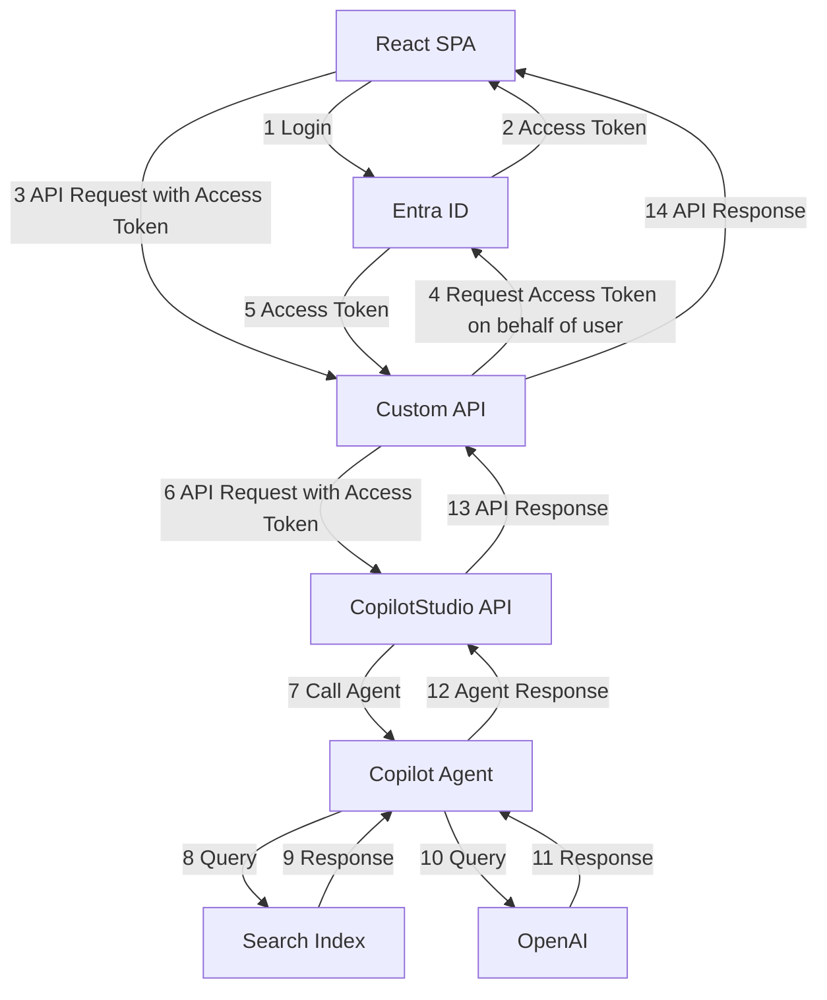

# Overall architecture

```mermaid
graph TD

    A[React SPA] -->|1 Login| F[Entra ID]
    F -->|2 Access Token| A
    A -->|3 API Request with Access Token| B[Custom API]
    B -->|4 Request Access Token on behalf of user| F
    F -->|5 Access Token| B
    B -->|6 API Request with Access Token| C[CopilotStudio API]
    C -->|13 API Response| B
    B -->|14 API Response| A
    C -->|7 Call Agent| G[Copilot Agent]
    G -->|12 Agent Response| C
    G -->|8 Query| D[Search Index]
    D -->|9 Response| G
    G -->|10 Query| E[OpenAI]
    E -->|11 Response| G

```
