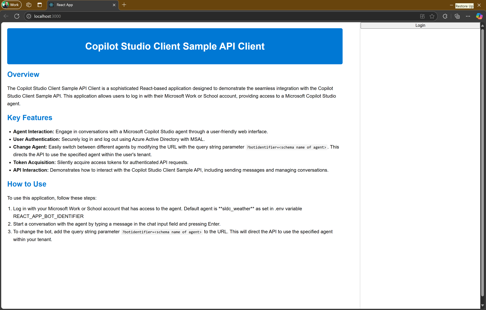
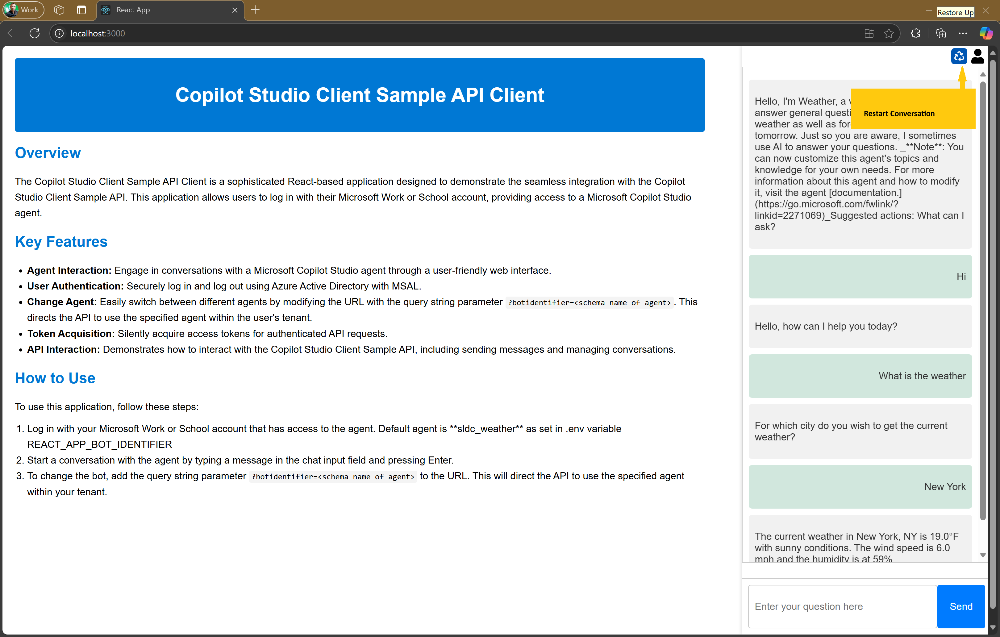

# Copilot Studio Client Sample API Client

The Copilot Studio Client Sample API Client is a React-based application that demonstrates the integration with the [Copilot Studio Client Sample API](../CopilotStudioClientSampleAPI/README.md). It includes features such as:

- **Agent Interaction**: I delivers a webUI to chat with a Microsoft Copilot Studio agent in a REACT Single Page App.
- **User Authentication**: Utilizes MSAL to authenticate users with Azure Active Directory. It allows to login and log out.
- **Change Agent**: Via query string parameter an other agent can be chosen chat with. The identifier is the schema name of the agent in Microsoft Copilot Studio.
- **Token Acquisition**: Acquires access tokens silently for making authenticated API requests.
- **API Interaction**: Demonstrates how to interact with the Copilot Studio Client Sample API, including sending messages and recycle conversation.

## Architecture

Below is diagram of the overall architecture. This project implements the React SPA.


## Prerequisites

- **App Registration**: For this application is required that an application is registered in Azure AD. This application must have enable permission for **User.Read** and **signin_as_user** (from CopilotStudioClientSampleAPI described in [link](../CopilotStudioClientSampleAPI/README.md)
- **Copilot Studio Client API**: This SPA calls an API that processes the calls to Copilot Studio. This is the API that is implemented in project [CopilotStudioClientSampleAPI](../CopilotStudioClientSampleAPI/README.md). Run this project on http://localhost:3000 before starting this application.

### Create a Agent in Copilot Studio

1. If not exist, create a Agent in [Copilot Studio](https://copilotstudio.microsoft.com)
    1. Publish your newly created Copilot
    1. Goto Settings => Advanced => Metadata and copy the following values, You will need them later:
        1. Schema name
        1. Environment Id

## Instructions - Setup

### Set Up environment Variables

Set up the environment variables that are need to run the client:

1. Copy [.env.template](./.env.template) to .env
1. Fill in the variables;
    1. REACT_APP_BOT_IDENTIFIER, this get the value of the Schema name of the agent created in previous step.
    1. REACT_APP_API_BASE_URL, this has default value <https://localhost:7270>. This points to the API that is available when [CopilotStudioClientSampleAPI](../CopilotStudioClientSampleAPI/README.md) is started.

### Set Up Authentication Variables

In authConfig.js set the correct variables for ClientID, TenantId, RedirectURL and the scope to get access token for the API.

| Key                | Description                                                                 |
|--------------------|-----------------------------------------------------------------------------|
| `clientId`         | The Client ID of your Azure AD application.                                 |
| `authority`        | The authority URL for your Azure AD tenant (e.g., `https://login.microsoftonline.com/{tenantId}`). |
| `redirectUri`      | The redirect URI for your application (e.g., `http://localhost:3000`).      |
| `scopes`           | The scopes required for your application (e.g., `api://your-api-id/signin_as_user`). |

### Install Dependencies

Run the below script in the root folder.

```sh
npm install
```

### Run the Application

Run the below script in the root folder.

```sh
npm start
```

This will build the solution and open a browser that opens http://localhost:3000

## Screen shot of usage

Open and Login  


Login with Entra ID  


Question the agent  


Restart the conversation  


## File Structure

- `src/index.js`: Entry point of the application, sets up MSAL and React Router.
- `src/App.js`: Main application component, handles user interactions and API requests.
- `src/SamplePage.js`: Sample page component with rich content and styling.
- `src/authConfig.js`: Configuration for MSAL authentication.
- `src/App.css`: CSS styles for the application.

## Usage

- **Login**: Users can log in using their Azure AD credentials.
- **Chat**: Chat with a Copilot Studio Agent via an intermediate API.
- **Restart Conversation**: Start a new conversation, forgetting the history.

## Technologies Used

- **React**: Frontend library for building user interfaces.
- **MSAL**: Microsoft Authentication Library for authentication and token management.
- **React Router**: Library for routing in React applications.
- **Fetch API**: Native JavaScript API for making HTTP requests.

This sample client provides a comprehensive example of integrating authentication, API interaction, and state management in a React application.
