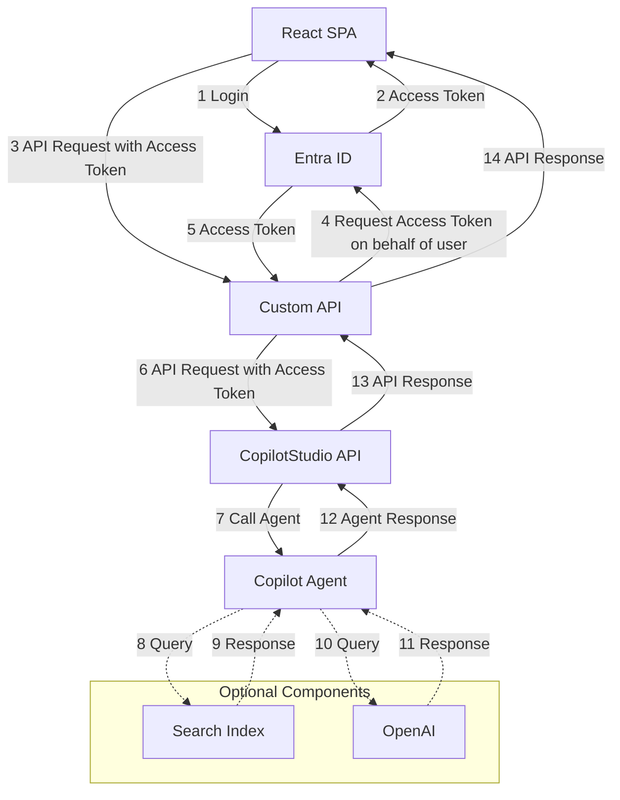

# Copilot Studio Client API and SPA Sample

The Copilot Studio Client API and SPA Sample is an example application that demonstrates how a user can log in with their Entra ID account on a Single Page Application (SPA) built with React. This application utilizes a .NET API that leverages the Microsoft 365 Agents SDK. Through this setup, the API can interact with any Copilot Studio Agent, enabling the creation of conversations that can be access via a React SPA.

## Key concepts in this sample

1. A React SPA application that has "pane" for the conversation and a sample content part. Via the query string the identifier of the Microsoft Studio Copilot Agent can be set.
2. A .NET API that uses the Microsoft 365 Agent SDK to talk with any agent the user has access too.

## Architecture

In below diagram the overall architecture of the sample is given.

## Pre-requisites and Starting the sample

1. The samples requires EntraId application registration. This is described in the documentation for the SPA and API.
1. The sample require one of more existing Microsoft Copilot Studio agents that are publish and where the user has permission too.

## Documentation

1. [Readme for Client in React SPA](./CopilotStudioClientSampleAPIClient/README.md)
1. [Readme for API Backend](./CopilotStudioClientSampleAPI/README.md)

